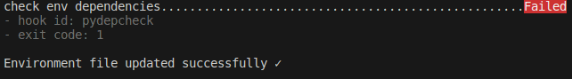

# PyDepCheck

## Introduction

**Python Depencencies Check** it is a module that automatically check if the dependencies used in the code appear in the environment file (`conda.yaml` or `requirements.txt`) but forgot to add manually to these files.

In this way, the files with the dependencies are always aligned with the dependencies you are using in the code.

> [!NOTE]
> Works for conda virtual environments and with `conda.yaml` and `requirements.txt` files.

## How it works

It looks in your code to see what libraries you are using, discards internal python libraries and is left with only the libraries that need to be installed. These are the ones we need to add in the dependency files.

Once you have these libraries, take the version you are using in your conda environment and add it to the dependency file if it is not already added.

It only needs 2 parameters, the file you want to check and the conda environment you use for that project.

> [!WARNING]
> It does not remove unused libraries from your dependency file. It only adds libraries that are not in your dependency file.

## pre-commit Hook

### Requirements

- [pre-commit](https://pre-commit.com/)
- Python 3.8+

### Quick Start

For convenience, add it as a hook to your .pre-commit-config.yaml, or if you don't have one, create a new one with this hook.

```yaml
# .pre-commit-config.yaml
repos:
  - repo: https://github.com/jorgenusan/pydepcheck.git
    rev: v0.1.2
    hooks:
      - id: pydepcheck
        args: ['--env-file', 'conda.yaml', '--env-name', 'pydepcheck']
```

With this configuration, every commit you make will check that all dependencies are added.



## Run locally

1. Conda env

   ```bash
   conda create -n pydepcheck python=3.9 -y
   conda activate pydepcheck
    ```

2. install the repository

   ```bash
   python setup.py install
   ```

3. Execute pydepcheck

    ```bash
    python pydepcheck/main.py --env_file [file.txt/file.yaml] --env_name pydepcheck
    ```

